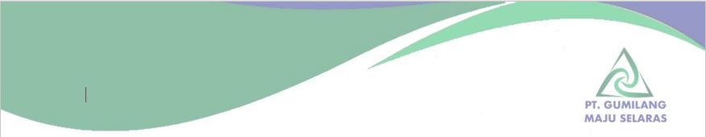

<!DOCTYPE html>
<html lang="id">
<head>
    <meta charset="UTF-8">
    <meta name="viewport" content="width=device-width, initial-scale=1.0">
    <title>Kwitansi - Template Fleksibel 1 Halaman</title>
    
</head>
<body>

    

        <h3>Input Data Kwitansi</h3>
        

            <label>Nomor Kwitansi</label>
            <input type="text" id="inNo" value="KW-2026-001">
        

        

            <label>Telah Diterima Dari</label>
            <input type="text" id="inNama" value="Samsuri Sidik">
        

        

            <label>Jumlah Uang (Angka)</label>
            <input type="number" id="inUang" value="35000000">
        

        

            <label>Untuk Pembayaran</label>
            <textarea id="inUntuk" rows="4">Material dan consumable pada proyek “Pemasangan Instalasi Pipa Air Compressor Sus-304” Berlokasi di SPIN, Jl. Raya Narogong, Bekasi</textarea>
        

        

            <label>Kota & Tanggal</label>
            <input type="text" id="inTanggal" value="Bandung, 7 Juli 2026">
        

        

            <label>Nama Kasir / Admin</label>
            <input type="text" id="inJabatan" value="Kasir / Admin">
        

        <button class="btn-cetak" onclick="window.print()">Cetak / Simpan PDF</button>
    

    

        
        

            
        

        
        

            

                

                    <h1>KWITANSI</h1>
                    
No. <b>-</b>

                

            

            

            

                
Telah Diterima Dari

                
:

                
-

            

            

                
Uang Sejumlah

                
:

                

            

            
-

             

            

                
Untuk Pembayaran

                
:

                
-

            

            

                
Rp. 0,-

                

                    
-

                    
Kasir / Admin

                

            

            

                
            

        

    

</body>
</html>
